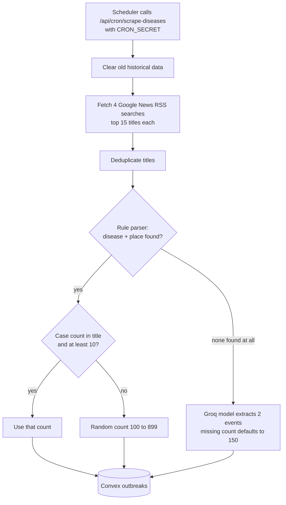

# Methodology

How HealthNex produces the numbers and text it shows: where outbreak data comes from, how it is parsed, how water-quality indicators and forecasts are generated, what happens when AI is unavailable, and how access control works. Everything here is implemented in `src/app/api/`, `src/lib/` and `convex/`.

The aim of this document is plain honesty about data provenance. Several values are estimates, rules of thumb or AI output, not measurements, and this document says which.

[← Back to README](./README.md)

## Contents

1. [Outbreak data pipeline](#1-outbreak-data-pipeline)
2. [Water-quality indicators](#2-water-quality-indicators)
3. [Outbreak risk prediction](#3-outbreak-risk-prediction)
4. [Regional forecast](#4-regional-forecast)
5. [Symptom analysis and health Q&A](#5-symptom-analysis-and-health-qa)
6. [Hospital finder](#6-hospital-finder)
7. [Access control and authentication](#7-access-control-and-authentication)
8. [Rate limiting](#8-rate-limiting)
9. [Limitations](#9-limitations)

---

## 1. Outbreak data pipeline

1. **Clear.** The job first deletes the existing outbreak history, so the map only shows what this run produces.
2. **Collect.** It fetches four news searches about outbreaks in India and keeps the first 15 headlines of each.
3. **Parse by rules.** A headline becomes an outbreak when it contains **both** a disease name from a list of about 36 diseases and a place from a built-in table of states, union territories and a few cities (each with fixed coordinates). One outbreak is kept per disease and place.
4. **Case count.** If the headline contains a number followed by "cases", "infections", "deaths" or "patients", that number is used. **Otherwise, or if the number is under 10, the count is set to a random whole number from 100 to 899.** Deaths and recoveries are always stored as 0.
5. **Label.** Rule-parsed rows are saved with the suffix "(Verified News)". No verification is performed. The label only means the row came from a news headline.
6. **AI fallback.** If the rules found nothing and a Groq key exists, a model is asked to extract two outbreaks from the first 10 headlines. A missing place falls back to the centre of India, and a missing count defaults to 150. These rows are labelled "(Groq AI)".

**What this means.** A dot on the map shows that a headline mentioned a disease and a place. Its case count may be a random number. It is a signal worth a human check, not surveillance data.

**Other sources.** An admin can load `public/docs/idsp_historical_data.csv`, a 15-row file of outbreaks written as if from India's IDSP programme. Its provenance is not documented, so treat it as sample data. A route also reads WHO Global Health Observatory indicators, and users can add community reports, which staff approve.

**Dashboard "simulate".** A button on the dashboard creates a fake incident in the browser from a random place, disease, severity and 20 to 74 cases. It exists for demonstration.

## 2. Water-quality indicators

The water-quality page shows pH, turbidity and a risk level for a location. **These values are not measurements.** They are calculated from the current weather and the coordinates:

$$\text{seed} = \sin(\text{lat})\cdot\cos(\text{lon})$$

$$\mathrm{pH} = \mathrm{clamp}\bigl(7.2 - \min(0.6,\ 0.04\,r) - 0.25\,\text{seed},\ 6.0,\ 8.5\bigr)$$

$$\text{turbidity} = \mathrm{clamp}\bigl(1.2 + 2.1\,r + 1.5\,|\text{seed}|,\ 0.5,\ 25.0\bigr)\ \text{NTU}$$

where $r$ is the current precipitation in millimetres from Open-Meteo. The risk level is **High** when turbidity is above 5 NTU, or pH is below 6.5 or above 8.0, otherwise **Low**. Because the "seed" depends only on the location, a place always gets the same base values, and they move with rainfall.

So the page behaves as a rainfall-driven heuristic: heavy rain raises "turbidity" and lowers "pH". It is a reasonable rule of thumb but it knows nothing about any real water source.

**Recommendations.** For the location, the app asks Gemini for 3 or 4 short safety recommendations. If the call fails, a rule set replaces it:

| Condition | Advice |
| :--- | :--- |
| Turbidity above 5 NTU | Filter through clean cloth and boil water for 1 to 2 minutes |
| pH outside 6.5 to 8.5 | Test other sources and inspect pipelines |
| Rainfall above 10 mm | Inspect storage tanks and chlorinate |

The thresholds follow common drinking-water guidance (turbidity under 5 NTU, pH 6.5 to 8.5), but the inputs are the estimates above.

## 3. Outbreak risk prediction

`POST /api/predict` takes a type, population density, a sanitation figure and a short history, and returns a probability, a peak window, a severity, recommendations and risk factors.

- **With Gemini:** a prompt asks the model, in the role of an epidemiologist, to return that JSON. The output is not checked beyond being valid JSON, and nothing compares it with real outcomes.
- **Without Gemini (fallback rules):**

| Condition | Probability | Severity | Peak window |
| :--- | :---: | :--- | :--- |
| Density $> 400$ **or** sanitation index $< 60$ | 78% | high | 1 to 2 weeks |
| Otherwise | 45% | medium | 3 to 5 weeks |

  Risk factors are labelled from the same two thresholds.
- **Missing inputs are filled in.** If the request has no usable fields, the route substitutes a population density of 250, a sanitation index of 75 and a history of `[1, 2, 1, 3, 2, 1]`. A request with no data therefore still returns a confident-looking prediction.

The probabilities are model text or fixed rule outputs. They are not calibrated and not validated.

## 4. Regional forecast

`POST /api/health-forecast` takes a list of district records and returns a summary, high-risk areas and monthly predicted incidents.

- **With Gemini:** a model writes the forecast from the data.
- **Fallback:** "high-risk" districts are those with more than 40 incidents (or cases). The monthly values are the average incident count multiplied by fixed factors:

$$\text{Jul} = 1.10\,\bar{n},\qquad \text{Aug} = 1.25\,\bar{n},\qquad \text{Sep} = 0.95\,\bar{n}$$

  The text always says incidents will rise "by approximately 15% ... due to monsoon onset", whatever the data says.

This is a template, not a forecast.

## 5. Symptom analysis and health Q&A

The symptom checker, symptom analyzer, health assistant, health query and chatbot routes send the user's text to Gemini (or Groq for the symptom checker) with a system prompt. Prompts ask for a JSON answer that includes a likely condition, urgency and recommended actions, and require a statement that the result is not a medical diagnosis. When the model call fails, the routes return canned answers such as "seek emergency medical consultation" or "consult a physician".

Nothing in the app checks medical correctness, and the model can be wrong. The output is for general information only and must never replace a clinician's advice.

## 6. Hospital finder

The hospital search queries OpenStreetMap through the Overpass API for facilities near a point, then computes the distance to each with the Haversine formula ($R = 6371$ km) and sorts by distance:

$$d = 2R\,\mathrm{atan2}\bigl(\sqrt{a},\ \sqrt{1-a}\bigr),\qquad a = \sin^2\tfrac{\Delta\phi}{2} + \cos\phi_1\cos\phi_2\sin^2\tfrac{\Delta\lambda}{2}$$

Results are only as complete as the OpenStreetMap data for that area, and facility details (beds, services, opening hours) are not verified.

## 7. Access control and authentication

- **Passwords** are hashed with bcrypt (12 rounds). Login returns a token signed with HS256 that expires after one day.
- **Convex functions.** About two thirds of the Convex functions are wrapped by `queryWithAuth` or `mutationWithAuth`. These verify the token inside Convex and pass the user's ID to the handler, so they cannot be called without a valid login even if someone talks to Convex directly.
- **Roles** are `public-user` (level 0), `health-worker` (1) and `admin` (2). A sign-up that asks for `health-worker` stays `public-user` with a pending verification until an admin verifies it.
- **Scraper writes** need the `CRON_SECRET`, checked both in the Next.js route and inside the Convex mutations.
- **Public functions** include reading reports, alerts and outbreaks, `createUser` and the `mergeRoles` migration. The AI and data API routes do not require a login.

## 8. Rate limiting

The limiter is a fixed-window counter held in a JavaScript `Map` keyed by route and client IP, with defaults of 5 requests per 60 seconds. Expired entries are cleaned on each call. Because it is in memory, it resets whenever the server restarts and each server instance counts separately, so on serverless hosting it gives only light protection. Several routes (`predict`, `health-forecast`, `water-quality`, `hospitals`) do not use it.

## 9. Limitations

- **Provenance.** The scraper can store invented case counts, and "Verified News" does not mean verified.
- **Estimated water data** presented as measured values.
- **Unvalidated AI predictions.** Probabilities and forecasts are language-model text or fixed templates.
- **Defaults hide missing inputs** in the prediction route.
- **Scheduler absent.** Nothing in the repository runs the scraper, so without an external cron the map may stay empty or stale.
- **Single-country focus.** Place matching covers Indian states, union territories and a few cities only.
- **No evaluation.** There are no measurements of scraper precision, AI accuracy or forecast error.
- **Not for clinical or policy decisions.**
