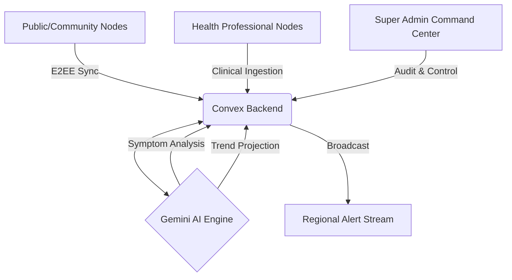
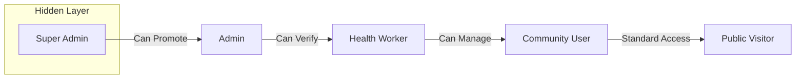

# HealthNex Intelligence Protocol
### Unified Global Health Surveillance & Proactive Response Layer

HealthNex is an industry-grade intelligence protocol designed to standardize the world's health response through decentralized reporting, neural forecasting, and zero-trust data synchronization. It bridges the gap between ground-level community intelligence and institutional medical response using advanced AI.

---

## 📑 Table of Contents
1.  [System Overview](#system-overview)
2.  [Core Architecture](#core-architecture)
3.  [Role-Based Access Control (RBAC)](#role-based-access-control-rbac)
4.  [Key Features](#key-features)
5.  [AI & Neural Engine](#ai--neural-engine)
6.  [Database Schema](#database-schema)
7.  [Institutional Onboarding](#institutional-onboarding)
8.  [Security & Privacy](#security--privacy)

---

## 🏛 System Overview
HealthNex operates as a distributed intelligence network where every user acts as a node. The system is architected for sub-second latency and high availability in low-connectivity environments.

### System Architecture Diagram

---

## 🔐 Role-Based Access Control (RBAC)
The protocol utilizes a strictly tiered access model to ensure data integrity and institutional security.

| Role | Description | Key Permissions |
| :--- | :--- | :--- |
| **Super Admin** | Root system controller | Full audit logs, user promotion/demotion, system maintenance. |
| **Admin** | Protocol manager | Verification queue management, global alert broadcasting. |
| **Health Worker** | Medical professional | Clinical data verification, regional symptom analysis. |
| **Community User** | Verified citizen | Interactive hotspots map, health reporting, private tracker. |
| **Public Visitor** | Default new account | Education access, global feed viewing, marketing suite. |

### Access Management Logic

---

## 🚀 Key Features

### 1. Intelligence Center (Dashboard)
*   **Geospatial Hotspots Map**: Real-time visualization of health anomalies and disease distribution.
*   **Local Pulse HUD**: Immediate regional context including safety scores and node response times.
*   **Telemetry Trends**: Monospaced monitored streams of regional health data points.

### 2. Community Intelligence (`/community-reports`)
*   **Decentralized Reporting**: Ground-level submission of water quality and health issues.
*   **My Intelligence**: Personal tracker for users to monitor the status of their contributions.
*   **Global Feed**: A real-time stream of verified community intelligence payloads.

### 3. Health Hub Discovery (`/resources`)
*   **Verified Facility Search**: Find nearby hospitals, labs, and pharmacies with live status indicators.
*   **Navigation Integration**: Direct routing to the nearest intelligence node or care center.

### 4. Broadcast Center (`/alerts`)
*   **Regional Alerts**: authorized personnel can broadcast high-priority warnings (Outbreak, Water, Weather).
*   **Active Stream**: A live visualizer of all active broadcasts within the global network.

---

## 🧠 AI & Neural Engine
HealthNex integrates **Gemini v1.5 Pro** to provide high-fidelity clinical and predictive intelligence.

*   **Multilingual Voice Assistant**: Voice-to-text capture in **Bengali, Hindi, and English** for symptom reporting.
*   **Symptom Cluster Analysis**: Heuristic identification of regional health trends from community ground-telemetry.
*   **Neural Forecasting**: Projection of threat vectors and outbreak risks with dynamic confidence metrics.

---

## 🗄 Database Schema
The protocol is powered by a high-performance **Convex** backend with the following core entities:

| Table | Indexing | Purpose |
| :--- | :--- | :--- |
| `users` | `by_email`, `by_verification_status` | Multi-tier identity and institutional role tracking. |
| `healthData` | `by_user`, `by_timestamp` | Secure clinical records and symptom reports. |
| `communityReports` | `by_status`, `by_category` | Ground-level intelligence and water quality alerts. |
| `auditLogs` | `by_timestamp` | Immutable record of all administrative actions. |
| `alerts` | `by_active`, `by_severity` | Regional broadcast payloads and system warnings. |

---

## 🛡 Security & Privacy
*   **Zero-Trust Integration**: Multi-layer verification for all administrative and clinical actions.
*   **E2EE Protected Records**: Medical data is encrypted during synchronization to the distributed backend.
*   **Administrative Transparency**: Immutable audit logs ensure every role change and alert is accountable.

---

## 🛠 Tech Stack
*   **Frontend**: Next.js 15 (App Router), Tailwind CSS, Framer Motion.
*   **Backend/Database**: Convex (Real-time synchronization).
*   **Intelligence**: Google Gemini AI v1.5.
*   **UI Components**: Shadcn UI (Radix Primitives).

---

© 2026 HealthNex Intelligence Protocol. Built for Global Health Security.
