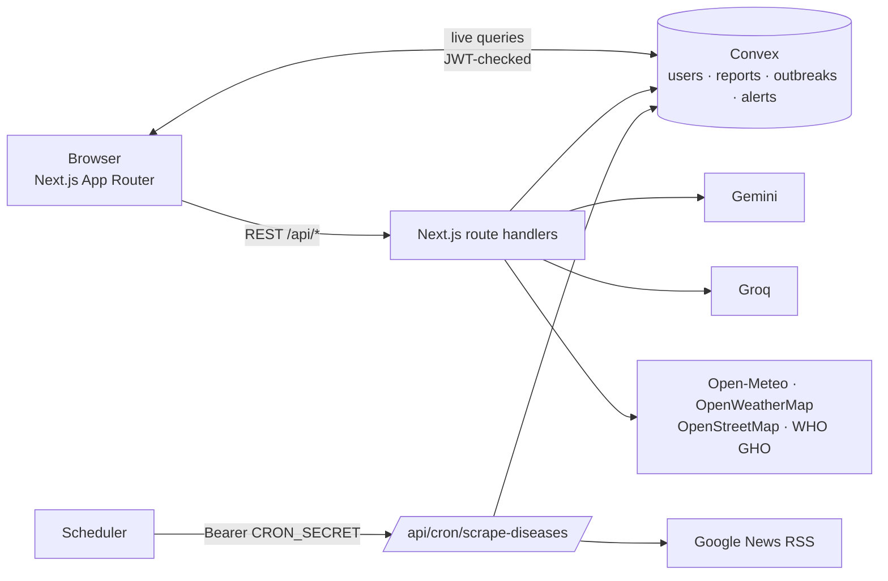

<div align="center">

# HealthNex

### A public-health surveillance dashboard with AI-assisted analysis

_Track reported outbreaks on a map, read community reports, check symptoms with AI and get water-safety guidance, in English, Hindi or Bengali._

[](LICENSE)


[Quickstart](#quickstart) · [Features](#features) · [Architecture](#architecture) · [Methodology](./METHODOLOGY.md) · [Data honesty](#what-is-real-data) · [Project status](#project-status) · [Live demo](https://health-nex-one.vercel.app/) · [Report an issue](https://github.com/ArrinPaul/HealthNex/issues)

</div>

---

## About

HealthNex is a web app for watching and responding to public-health events in India. It shows reported disease outbreaks on a map, lets community members file reports that health workers review, and gives everyone AI-assisted tools: a symptom checker, a health Q&A assistant, outbreak risk and trend forecasts, a water-safety advisor and a nearby-hospital finder. Administrators approve health-worker accounts and review audit logs.

It is built on Next.js and [Convex](https://convex.dev) (a real-time database and backend). The AI features use Google Gemini, with Groq as a second provider for some tasks. When AI is unavailable, most features fall back to simple built-in rules so the pages still work.

**Who it's for:** public-health teams and students exploring surveillance dashboards, and developers who want a reference for a role-based Next.js and Convex app.

> **This is a prototype, not a medical or epidemiological tool.** Several numbers it shows are estimated, simulated or produced by an AI model, not measured. Read [What is real data?](#what-is-real-data) before you rely on any figure.

## Table of Contents

1. [About](#about)
2. [Features](#features)
3. [What is real data?](#what-is-real-data)
4. [Architecture](#architecture)
5. [Roles and access](#roles-and-access)
6. [Tech stack](#tech-stack)
7. [Quickstart](#quickstart)
8. [Configuration](#configuration)
9. [API overview](#api-overview)
10. [Security](#security)
11. [Testing](#testing)
12. [Scripts](#scripts)
13. [Project structure](#project-structure)
14. [Deployment](#deployment)
15. [Project status](#project-status)
16. [Troubleshooting](#troubleshooting)
17. [Documentation](#documentation)
18. [Contributing](#contributing)
19. [License](#license)

## Features

| Area | What it does |
| :--- | :--- |
| **Dashboard and surveillance map** | Outbreaks plotted by location with disease, case counts and severity, and summary statistics |
| **Community reports** | Users submit reports that health workers or admins approve or reject |
| **Alerts and broadcasts** | Active alerts shown across the app, with an admin view of all alerts |
| **Symptom checker** | AI-assisted assessment from symptoms, with a stored history per user. It states that it is not a diagnosis. |
| **AI features hub** | Symptom analysis, a health Q&A assistant, outbreak risk prediction and regional trend forecasts |
| **Chat assistant** | A conversational health assistant with message history |
| **Water quality** | Estimated water indicators and safety recommendations for a location, using live weather (see [What is real data?](#what-is-real-data)) |
| **Hospital finder** | Nearby hospitals and clinics from OpenStreetMap, sorted by distance |
| **Disease statistics** | Outbreak data from a news scraper, an admin seed file and WHO indicators |
| **Admin panel** | User management, health-worker verification, approval queues and audit logs |
| **Onboarding and settings** | First-run profile setup, language settings (English, Hindi, Bengali) and theme |
| **Installable PWA** | Service worker and offline page |
| **Education and resources** | Static health-education and resource pages |

## What is real data?

Public-health software can mislead if its numbers are not clear. This is what each kind of data in HealthNex really is.

| Data | Where it comes from | How much to trust it |
| :--- | :--- | :--- |
| **Outbreaks from the scraper** | Headlines from Google News RSS, matched with keyword rules for disease, place and case count. If no case count is in the headline, **a random number between 100 and 899 is used**. | Low. The "Verified News" label does not mean verified. Counts can be invented. |
| **Outbreaks from the AI fallback** | A language model extracts events from headlines when the rules find none. A missing case count defaults to 150. | Low |
| **Community reports** | Submitted by users and approved by staff | Depends on who reports and who approves |
| **Sample data file** | `public/docs/idsp_historical_data.csv`, 15 rows labelled as IDSP outbreaks, loadable by an admin | Unknown provenance. Treat it as sample data. |
| **Water pH and turbidity** | **Computed, not measured.** They are derived from current rainfall plus a number made from the coordinates (`sin(lat)·cos(lon)`). | None as a measurement. It is a plausible-looking estimate, the same for the same place and weather. |
| **Weather** | Open-Meteo and OpenWeatherMap | Good (third-party data) |
| **Hospitals** | OpenStreetMap through the Overpass API | Good where the map is complete |
| **Outbreak predictions and forecasts** | A language model, or fixed fallback rules if AI is off | Illustrative only. Not an epidemiological model. |
| **"Simulate event" on the dashboard** | Random disease, place and case count generated in the browser | Fake by design |

The details and formulas are in [METHODOLOGY.md](./METHODOLOGY.md).

## Architecture


```mermaid
flowchart LR
    B[Browser<br/>Next.js App Router] -->|REST /api/*| API[Next.js route handlers]
    B <-->|live queries<br/>JWT-checked| CX[(Convex<br/>users · reports · outbreaks · alerts)]
    API --> CX
    API --> GM[Gemini]
    API --> GQ[Groq]
    API --> EXT[Open-Meteo · OpenWeatherMap<br/>OpenStreetMap · WHO GHO]
    CRON[Scheduler] -->|Bearer CRON_SECRET| SC[/api/cron/scrape-diseases/]
    SC --> NEWS[Google News RSS]
    SC --> CX
```

- **Pages and API** live in one Next.js app (`src/app`). Route handlers call the AI providers and external services.
- **Convex** stores users, reports, outbreaks, alerts, chat messages, health assessments, usage tracking and audit logs. Most functions are wrapped so a valid login token is required.
- **Sign-in** uses a password hashed with bcrypt and a signed token (HS256, valid for 1 day) that the Convex functions verify themselves.

## Roles and access

| Role | Can do |
| :--- | :--- |
| `public-user` | View data, file community reports, use the AI tools |
| `health-worker` | Review community reports. A health-worker account starts as `public-user` and only becomes a health worker after an admin verifies it. |
| `admin` | Everything above, plus user management, verification, audit logs and data seeding |

Signing up as a health worker creates a pending request. Role escalation is not possible through the sign-up call: the stored role always starts as `public-user`.

## Tech stack

| Layer | Technology |
| :--- | :--- |
| Framework | Next.js 15 (App Router), React 19, TypeScript |
| UI | Tailwind CSS 4, Radix UI, Three.js with React Three Fiber, tsParticles, Recharts, React Leaflet |
| Backend and data | Convex |
| Auth | bcryptjs (12 rounds), `jsonwebtoken` (HS256) |
| AI | Google Gemini (`gemini-2.0-flash`), Groq (`groq/compound`) |
| External data | Open-Meteo, OpenWeatherMap, OpenStreetMap Overpass and Nominatim, WHO GHO, Google News RSS |
| PWA | Serwist service worker |
| Validation | Zod |
| Testing | Vitest and Testing Library |
| CI | GitHub Actions |

## Quickstart

Prerequisites: Node.js 20 or newer, a [Convex](https://convex.dev) account and a [Gemini API key](https://aistudio.google.com/).

```bash
git clone https://github.com/ArrinPaul/HealthNex.git
cd HealthNex
npm install
cp .env.example .env.local        # then fill in the values (see Configuration)
```

In one terminal start Convex, which creates a deployment, generates the typed API and prints your URL:

```bash
npx convex dev
```

Put that URL in `NEXT_PUBLIC_CONVEX_URL` and set `CONVEX_DEPLOYMENT`, then in a second terminal:

```bash
npm run dev                       # http://localhost:3000
```

Register an account on the sign-up page. To create the first admin, set `SEED_ADMIN_EMAIL`, `SEED_ADMIN_PASSWORD` and `SEED_ADMIN_NAME` in your environment and run `npm run seed:admin`. **If you leave them unset, the script creates `admin@healthnex.com` with the well-known password `AdminPass123!`.** Always set your own values, or change the password straight away.

Convex also needs `JWT_SECRET` (the same value as in `.env.local`) and `CRON_SECRET` in its own environment: `npx convex env set JWT_SECRET <value>`.

## Configuration

| Variable | Required | Purpose |
| :--- | :---: | :--- |
| `JWT_SECRET` | Yes | At least 32 characters. Signs login tokens. Also set it in the Convex environment (`npx convex env set JWT_SECRET ...`). |
| `GOOGLE_AI_API_KEY` | For AI | Gemini key. Without it, AI routes use built-in fallback rules. |
| `GROQ_API_KEY` | For some AI | Used by the symptom checker and the scraper's AI fallback |
| `CONVEX_DEPLOYMENT`, `NEXT_PUBLIC_CONVEX_URL` | Yes | Your Convex deployment |
| `CRON_SECRET` | In production | Required to call `/api/cron/scrape-diseases` and to run the Convex data-writing functions |
| `NEXT_PUBLIC_APP_URL`, `NEXT_PUBLIC_API_BASE_URL` | Yes | App and API base URLs |
| `NEXT_PUBLIC_WEATHER_PROVIDER`, `NEXT_PUBLIC_NOMINATIM_URL` | No | Weather source and geocoding URL |
| `NEXT_PUBLIC_ENABLE_AI_FEATURES`, `..._VOICE_CHAT`, `..._REALTIME`, `..._DEBUG` | No | Feature flags |
| `SEED_ADMIN_EMAIL`, `SEED_ADMIN_PASSWORD`, `SEED_ADMIN_NAME` | For seeding | Read by `npm run seed:admin`. Defaults are a public email and password, so always override them. (`.env.example` lists `TEST_ADMIN_*` names, which the script does not read.) |

## API overview

Route handlers are in `src/app/api/`.

| Group | Routes |
| :--- | :--- |
| Auth | `auth/register`, `auth/login`, `auth/logout`, `auth/me`, `user/onboarding` |
| AI | `ai/analyze-symptoms`, `ai/symptom-checker`, `ai/health-assistant`, `ai/health-query`, `ai/process-report`, `chatbot/message`, `suggestions/*` |
| Analysis | `predict`, `health-forecast`, `water-quality`, `water-quality/analyze` |
| Data | `health`, `health/who`, `health/seed-idsp` (admin), `hospitals`, `weather` |
| Automation | `cron/scrape-diseases` (needs `CRON_SECRET`) |

## Security

What exists:

- Passwords are hashed with bcrypt (12 rounds), and tokens expire after 1 day.
- Most Convex functions are wrapped so a valid token is required, and the token is verified inside Convex, not only in the web layer.
- Data-writing scraper functions require the `CRON_SECRET`, and the cron route refuses to run in production without it.
- Role changes require an admin. A requested health-worker role is never granted at sign-up.
- AI prompts tell the model to ignore instructions that try to change its role, and inputs are validated with Zod.

Known gaps:

- **Some Convex functions are public**, including reading reports, alerts and outbreaks, `createUser` and the one-off `mergeRoles` migration. `mergeRoles` can be called by anyone and rewrites legacy role names.
- **Rate limiting is in memory** (`src/lib/rateLimit.ts`), so it resets on restart and is not shared between server instances.
- **The AI and data routes need no login.** The AI routes are rate-limited per client IP, but only in memory, and `predict`, `health-forecast`, `water-quality` and `hospitals` have no limit at all. AI calls cost money per request.
- **Default admin credentials.** The seed script falls back to a public email and password when its environment variables are unset.
- **A development fallback JWT secret exists** in `convex/lib/jwt.ts`. It throws in production when `JWT_SECRET` is missing, but a non-production Convex deployment without the variable would sign and accept tokens with a known secret.
- **The scraper trusts news headlines** and can store wrong or invented data (see [What is real data?](#what-is-real-data)).
- CI audits dependencies but does not fail on findings (`npm audit ... || true`).

## Testing

```bash
npx convex codegen    # generate the typed Convex API first
npm run lint          # clean at the time of writing
npm run typecheck
npm test              # Vitest: 4 files, 28 tests pass
npm run build
```

The unit tests cover the JWT helper, password validation, the rate limiter and utilities. Pages, API routes and the Convex functions have no automated tests. `npm run typecheck` fails until `npx convex codegen` has created `convex/_generated/`, which is git-ignored. CI runs codegen first, then lint, typecheck, tests, the build and a dependency audit on each push and pull request to `main`.

## Scripts

| Command | What it does |
| :--- | :--- |
| `npm run dev` | Next.js dev server |
| `npm run build` | `npx convex codegen`, then `next build` |
| `npm start` | Serve the production build |
| `npm run lint`, `npm run typecheck`, `npm test` | Checks |
| `npm run convex:dev` | Run Convex in development |
| `npm run convex:deploy` | Deploy Convex functions |
| `npm run seed:admin` | Create the first admin user |
| `npm run generate-sitemap` | Build the sitemap |
| `npm run deploy`, `deploy:preview`, `deploy:full` | Vercel and Convex deployment helpers |

## Project structure

```text
HealthNex/
├── src/
│   ├── app/              Pages (dashboard, surveillance, symptom-checker, water-quality, admin, ...) and api/
│   ├── components/       UI components and layout
│   ├── lib/              AI helper, JWT, rate limiting, validation, i18n
│   ├── services/         Client-side AI and health-data services
│   └── contexts/         Auth and settings providers
├── convex/               Schema, queries, mutations, auth wrappers, roles
├── public/               PWA files, locales (en, hi, bn), docs and diagrams
├── scripts/              Admin seeding and setup helpers
├── .github/workflows/    CI
├── .claude/skills/       Claude Code skill notes (development tooling, not app code)
├── CLAUDE.md, AGENTS.md  Notes for AI coding assistants
├── METHODOLOGY.md
└── LICENSE
```

## Deployment

The app is set up for Vercel plus a Convex deployment. Deploy Convex first (`npm run convex:deploy`), set the environment variables in Vercel and in Convex (`JWT_SECRET`, `CRON_SECRET`), then deploy the app. The repository has **no scheduler configuration**, so the disease scraper runs only if you call `/api/cron/scrape-diseases` with `Authorization: Bearer <CRON_SECRET>` from a cron service such as Vercel Cron.

## Project status

- **Prototype.** It is a working demo, not a validated surveillance system.
- **Estimated data presented as measurements** (water pH and turbidity) and **randomly filled case counts** in the scraper (see [What is real data?](#what-is-real-data)).
- **The "Verified News" label** on scraped outbreaks overstates their reliability.
- **Predictions are AI text.** The risk probabilities and forecasts come from a language model or from fixed fallback rules and have not been evaluated.
- **No scheduler** for the scraper is included.
- **Tests cover only helpers.**
- **Development files in the repo:** `.claude/skills/` and the assistant notes are tooling files, not part of the app.

## Troubleshooting

| Symptom | Likely cause | Fix |
| :--- | :--- | :--- |
| `npm run typecheck` says it cannot find `convex/_generated/api` | Convex types are not generated | Run `npx convex codegen` (or `npx convex dev`). |
| Login works but data calls fail with "Unauthorized" | `JWT_SECRET` differs between the app and the Convex environment | Set the same value in both. |
| AI pages show generic or canned answers | No valid `GOOGLE_AI_API_KEY`, or the model call failed | Add a key, and check the server log for "Falling back". |
| The map shows no outbreaks | No data has been scraped or seeded | Run the cron route with `CRON_SECRET`, or seed with an admin account. |
| `/api/cron/scrape-diseases` returns 503 | `CRON_SECRET` is not set in production | Set it and send it as a bearer token. |
| New health-worker account cannot review reports | It is still pending verification | An admin must verify it. |

## Documentation

| Document | Purpose |
| :--- | :--- |
| [METHODOLOGY.md](METHODOLOGY.md) | How each number is produced: scraper, fallbacks, water estimates, access control |
| [public/docs/diagrams](public/docs/diagrams) | Architecture, RBAC and flow diagrams |
| [CLAUDE.md](CLAUDE.md) | Notes for AI coding assistants working on the repo |

## Contributing

Issues and pull requests are welcome. Run `npx convex codegen`, then `npm run lint`, `npm run typecheck` and `npm test` before opening a PR, and never commit `.env` files or secrets. Changes that alter how data is produced should update [What is real data?](#what-is-real-data).

## License

Released under the MIT License. See [LICENSE](LICENSE).
